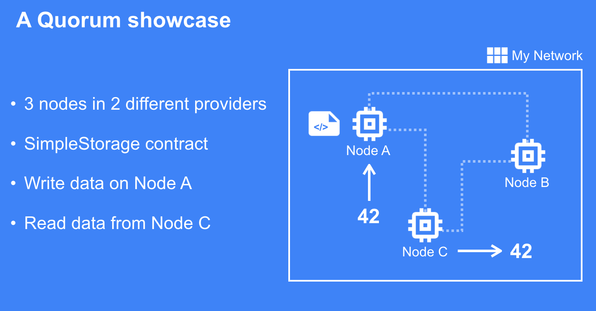

# quorum-in-minutes-showcase

Run a Quorum network, deploy smart contract and make transactions in minutes

## A Quorum showcase



## Step by step guide

1. Get free 14 days account at [console.chainstack.com](https://console.chainstack.com)
2. Deploy a Quorum network at chainstack portal with three nodes - Node A, B and C
3. Install Python 3, libraries and Jypyter

   ```bash
    # macos installer https://brew.sh/
    > brew install python
    > pip install py-solc web3 jupyter
    ```

4. Run jupyter notebook

    ```bash
    > jupyter notebook --no-browser
    ```

5. Follow the instructions inside notebooks

    - **(clickable on GitHub)** [01-quorum-meetup-writer.ipynb](./01-quorum-meetup-writer.ipynb)

    - **(clickable on GitHub)** [02-quorum-meetup-reader.ipynb](./02-quorum-meetup-reader.ipynb)
